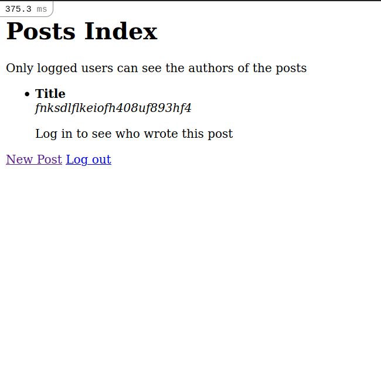

# Project Name

> This project is about mastering devise and understanding howw the authentication works in Rails. Its a basic web app where the user can onlywrite a post and  see the authors of every post once he has been logged in. When a new post has been created the app assigns the authoring to the current user in session.

Additional description about the project and its features.

## Built With

- Ruby on Rails 6.1.3.1

## Live Demo

Not available until this project is finished and merged to the master branch.

## Getting Started

To get a local copy up and running follow these simple example steps:

- Clone this repository to your local environment
- Run the command `bundle`
- Then run the command `rails db:migrate`
- After this run the command `rails s` to launch the web server.
- Open your browser and go to the address `localhost:3000`
- You can create a user now and start writing your own posts.

## Authors

👤 **Author1**

- GitHub: [@Daniduran-dev](https://github.com/Daniduran-dev)

## 🤝 Contributing

Contributions, issues, and feature requests are welcome!

Feel free to check the [issues page](../../issues/).

## Show your support

Give a ⭐️ if you like this project!

## Acknowledgments

-Thanks to the Raptorex group for their support.

## 📝 License

This project is [MIT](./MIT.md) licensed.
